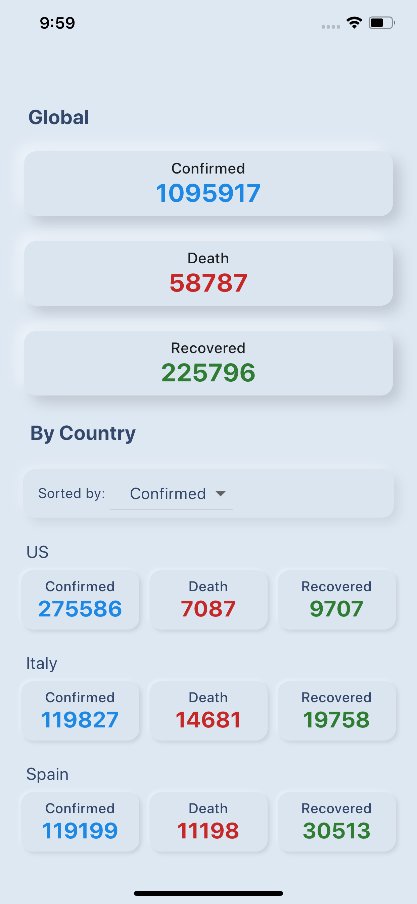
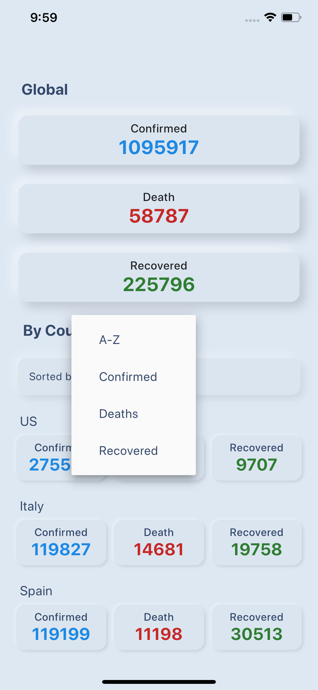
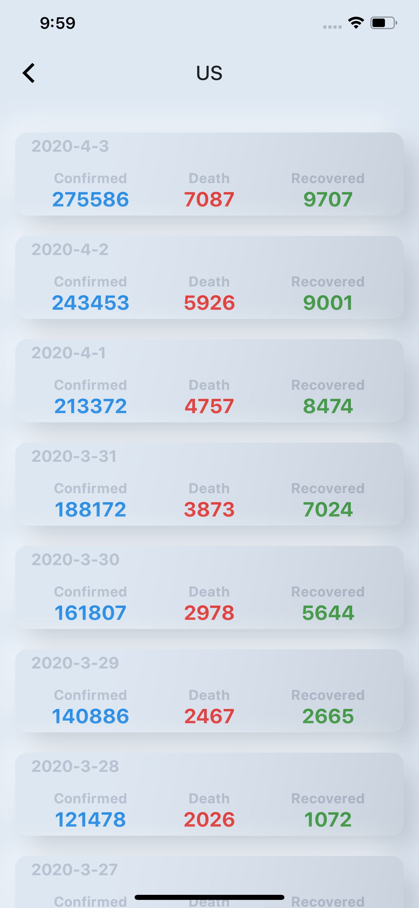
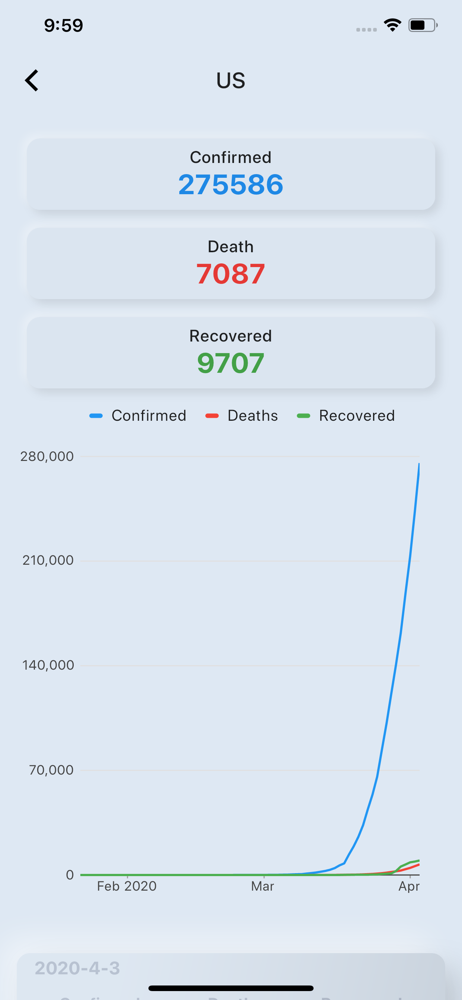

# COVID-19 Daily Statistics
 
This project is written with Flutter.

## What is in it?
- Updated data : Get data updated 3 times everyday by github actions.
- Neumorphism (Soft UI) https://github.com/Idean/Flutter-Neumorphic
- Charts : Charts for Country.

### Note:
For more details about the data part check: https://github.com/pomber/covid19 

## How to run ?
- Open this project in Android Studio / VS Code.
- Get Dependencies by running: "pub get".
- Run command "flutter run".
 

## Screenshots
<table>
  <tr>
    <td>Main Screen</td>
    <td>Sort By</td>
    <td>Country Daily Statistics</td>
    <td>Country Chart</td>
  </tr>
  <tr>
    <td></td>
    <td></td>
    <td></td>
    <td></td>
  </tr>
</table>

 

...
